# ServiceNow CI/CD Plugin for Jenkins

[](https://plugins.jenkins.io/servicenow-cicd)
[](https://github.com/jenkinsci/servicenow-cicd-plugin/releases/latest)
[](https://ci.jenkins.io/blue/organizations/jenkins/Plugins%2Fservicenow-cicd-plugin/activity/)
[](https://stats.jenkins.io/pluginversions/servicenow-cicd.html)
[](https://github.com/jenkinsci/servicenow-cicd-plugin/graphs/contributors)

## Contents

- [Intro](#intro)
- [Usage](#usage)
- [API Docs](#api-docs)
- [List of Build Steps](#build-steps)
- [Integration Tests](#integration-tests)
- [Troubleshooting](#troubleshooting)
- [Support Model](#support-model)
- [Governance Model](#governance-model)

---

## Intro

This extension provides Build Steps for setting up Continuous Integration (CI) or Continuous Delivery (CD) workflows using Jenkins for developing applications on the [Now Platform from ServiceNow](https://www.servicenow.com/now-platform.html). **Click on the below screenshot to see a video for how you can use this extension to get started faster.**

[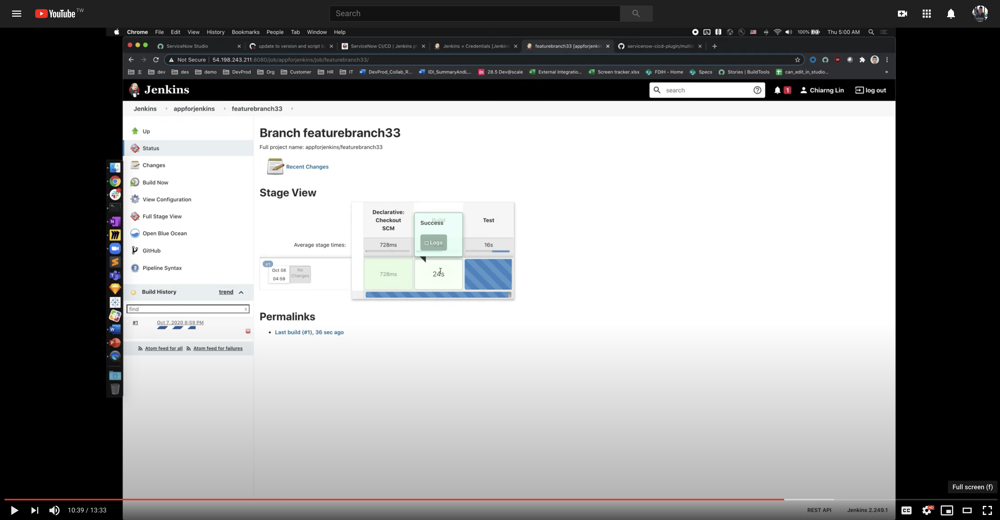](https://www.youtube.com/watch?v=MLa5dOu5zhY "Get Started with Jenkins in 10 Minutes")

The Build Steps are API wrappers for the [CI/CD APIs](https://developer.servicenow.com/dev.do#!/reference/api/paris/rest/cicd-api) first released with Orlando, and do not cover other ServiceNow APIs. They will currently work with the Orlando and Paris releases. 

Please reference our [open-source GitHub repo](https://github.com/jenkinsci/servicenow-cicd-plugin) for the implementation, as well as to submit any Issues or Pull Requests. For bug reports, see [bugs](https://issues.jenkins-ci.org/issues/?filter=22440) or [all open issues](https://issues.jenkins-ci.org/issues/?filter=22441). For documentation, see [official plugin site](https://plugins.jenkins.io/servicenow-cicd). For an example pipeline yml file, please copy from one of the existing [templates](examples/). 

## Usage

0. Create a new Jenkins Multi project under an organization of your choice. For more information, please refer to [documentation](https://docs.microsoft.com/en-us/azure/devops/organizations/projects/create-project?view=azure-devops&tabs=preview-page). 
1. [Link to Source Control](https://developer.servicenow.com/dev.do#!/learn/learning-plans/paris/new_to_servicenow/app_store_learnv2_devenvironment_paris_linking_an_application_to_source_control) for an application that has been created on your instance. You'll find the link in Azure Repos for your new project on Azure DevOps.  
2. On your master branch, you should see a blue "Set up build" button in Azure Repos. Click on it to create your pipeline yml file. Copy paste the [template](https://github.com/ServiceNow/servicenow-cicd-azure-extension/blob/master/examples/pipeline.yaml), and change your environment variables to match your application's `sys_id`, ATF Test Suite `sys_id`, etc. On the first time, you can commit and save to the master branch without running the pipeline yet. 
3. In Project Settings, look for the [`Service Connections` section](https://docs.microsoft.com/en-us/azure/devops/pipelines/library/service-endpoints?view=azure-devops&tabs=yaml) under "Pipelines". Create a new service connection of "ServiceNow CI/CD" type. You will need your instance URL, credentials for a service account, and note the name you're creating the Service Connection under. 
4. In Repos > Branches, for your master branch, set up a [branch policy](https://docs.microsoft.com/en-us/azure/devops/repos/git/branch-policies-overview?view=azure-devops#:~:text=Branch%20policies%20are%20an%20important,can%20contribute%20to%20specific%20branches) with an automatic trigger and make it required if this fits your workflow. 
5. Back on the pipeline, make sure to change the `connectedServiceName` parameters for the individual Tasks to match your new Service Connections. 
6. You should now be able to create a new feature branch off master branch on your instance, develop features/fixes, commit to Source Control, create a PR, and your CI build will run automatically. Once our CI build passes and your PR is completed and feature branch merged to master, your CD build to deploy the application to production should trigger as well. 

**Other Notes**

Tasks are all named starting with the **ServiceNow CI/CD** substring for easier organization and search filtering, and can be added via both the classic editor as well as the YAML editor in Azure DevOps. 

Some Tasks can produce output variables that are consumed as input for other Tasks. For example, the `Publish Application` Task generates a variable `publishVersion` that contains the version number for a recently published app. The `Install Application` Task can then consume this variable and produce a `rollbackVersion` variable that indicates the previous version of that app on the target instance, providing a mechanism for rolling back the application in `Rollback Application`. 

## API docs

The extension's Azure Pipelines Tasks are wrappers for the CI/CD APIs released as a part of Orlando, and will currently work through the Paris release. For more information, please see the ServiceNow [REST API documentation](https://developer.servicenow.com/dev.do#!/reference/api/orlando/rest/cicd-api). Tasks and APIs are not necessarily 1:1 matches; for example, the `ServiceNow CI/CD Start Test Suite` Task will trigger an ATF Test Suite run, get the progress, and when progress reaches 100%, will return the Test Suite result. 

## Build Steps

  * [Build steps](#build-steps)
    + [SN: Apply changes](#sn-apply-changes)
    + [SN: Publish application](#sn-publish-application)
    + [SN: Install application](#sn-install-application)
    + [SN: Roll back application](#sn-roll-back-application)
    + [SN: Run test suite with results](#sn-run-test-suite-with-results)
    + [SN: Activate plugin](#sn-activate-plugin)
    + [SN: Roll back plugin](#sn-roll-back-plugin)
  * [Global build parameters](#global-build-parameters)
    + [How to use](#how-to-use)
  * [Scripting](#scripting)
    + [Build steps](#build-steps-1)
    + [ServiceNow Parameters](#servicenow-parameters)
    + [Samples](#samples)

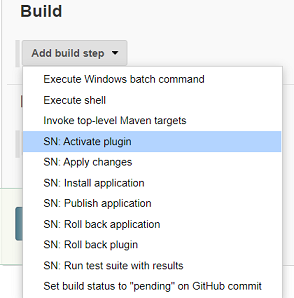

### Build steps
#### SN: Apply changes
Starts applying changes from a remote source control to a specified local application.
The source control must be configured on the platform.
There is available a bunch of configuration together with the build step:

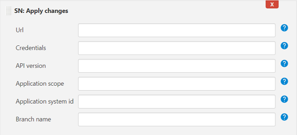

&nbsp; | Description
------| ------------
__Url__ | ServiceNow instance url, where an application will be published
__Credentials__ | User name and password defined in global credentials and configured in Jenkins (credentials ID is required here)
__API version__ | Optional. Version of the endpoint to access. For example, v1 or v2. Only specify this value to use an endpoint version other than the latest.
__Application scope__ | Required if *Application system id* is not specified. The scope name of the application for which to apply the changes, such as `x_aah_custom_app`. You can locate this value in the scope field in the Custom Application [sys_app] table.
__Application&nbsp;system&nbsp;id__ | Required if `Application scope` is not specified. The system id of the application for which to apply the changes. You can locate this value in the Sys ID field in the Custom Application [sys_app] table.
__Branch name__ | Name of the branch in the source control system from which to acquire the application.

#### SN: Publish application
Publishes the specified application and all of its artifacts to the application repository.

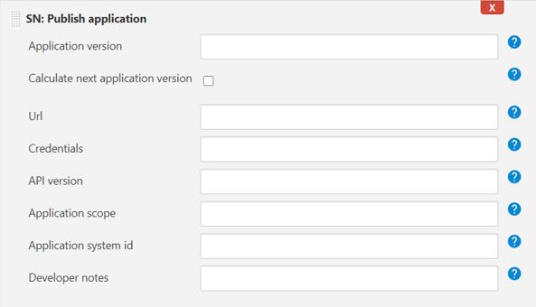

&nbsp; | Description
------| ------------
__Application version__ | Version under which to store the application. Provide 2 significant numbers separated by '.' eg. 1.0 (the third number will be automatically added with build number, what gives eg. 1.0.106).<br/>If the version number is passed, the publish process uses that version and updates the local application version if different. If the version number is not passed, the publish process uses the current version of the local application.
__Calculate&nbsp;next&nbsp;application&nbsp;version__ | Calculate next application version that will be published. Retrieve it in smart way using API or source control (if SCM is configured for the build). API has the highest priority, then SCM will be used.<br/>__*The value from 'Application version' will be ignored.*__
__Url__ | ServiceNow instance url, where an application will be published
__Credentials__ | User name and password defined in global credentials and configured in Jenkins (credentials ID is required here)
__API version__ | Optional. Version of the endpoint to access. For example, v1 or v2. Only specify this value to use an endpoint version other than the latest.
__Application scope__ | Required if *Application system id* is not specified. The scope name of the application for which to apply the changes, such as `x_aah_custom_app`. You can locate this value in the scope field in the Custom Application [sys_app] table.
__Application system id__ | Required if `Application scope` is not specified. The system id of the application for which to apply the changes. You can locate this value in the Sys ID field in the Custom Application [sys_app] table.
__Developer notes__ | Developer notes to store with the application.

#### SN: Install application
Installs the specified application from the application repository onto the local instance, the instance defined in the field *Url*. The application must have been previously published, using the build step [SN: Publish application](#sn--publish-application).

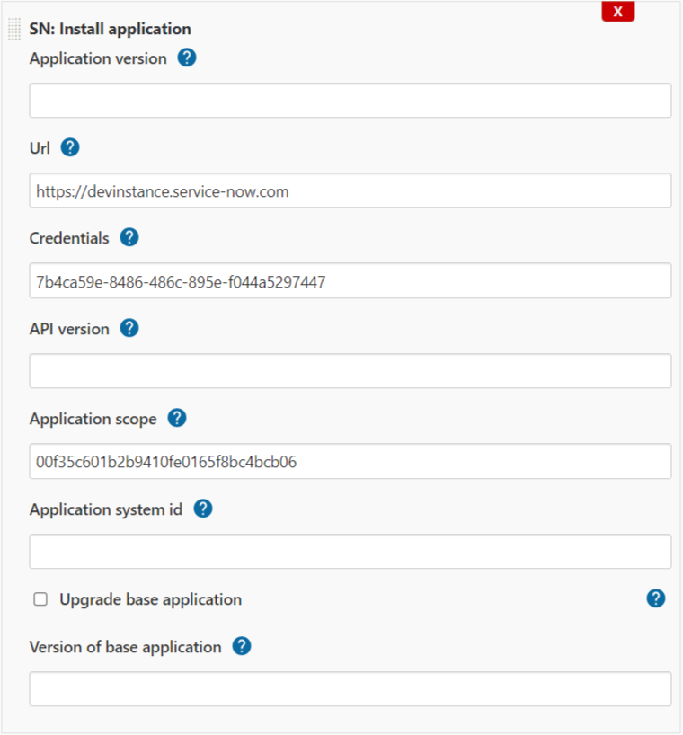
<div style="padding-left: 10px">

&nbsp; | Description
------| ------------
__Application version__ | Version of the application to install. If empty, the published version will be used.
__Url__ | ServiceNow instance url, where an application will be published.
__Credentials__ | User name and password defined in global credentials and configured in Jenkins (credentials ID is required here).
__API version__ | Optional. Version of the endpoint to access. For example, v1 or v2. Only specify this value to use an endpoint version other than the latest.
__Application scope__ | Required if *Application system id* is not specified. The scope name of the application for which to apply the changes, such as `x_aah_custom_app`. You can locate this value in the scope field in the Custom Application [sys_app] table.
__Application&nbsp;system&nbsp;id__ | Required if `Application scope` is not specified. The system id of the application for which to apply the changes. You can locate this value in the Sys ID field in the Custom Application [sys_app] table.

</div>

#### SN: Roll back application
Initiates a rollback of a specified application to a specified version, according to the configuration done in the build step.
If the field `Application rollback version` is empty and one of the previous steps was [SN: Install application](#sn-install-application),
then the downgrade version will be the one before the installation of the application.

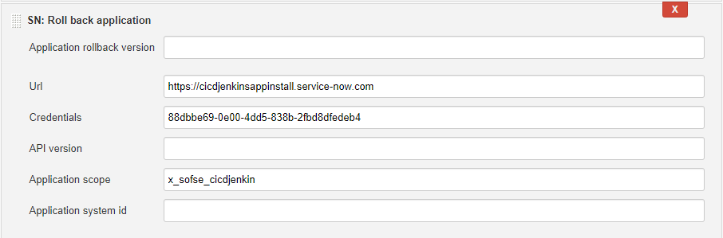

&nbsp; | Description
------| ------------
__Application&nbsp;rollback&nbsp;version__ | Expected rollback version. This version is compared to the version that is included in the last rollback context, if they don't match, the build step fails.<br/>If empty, last installed version from previous step will be taken.
&nbsp; | *Other parameters like described above.*

#### SN: Run test suite with results
Starts a specified automated test suite. The test suite runs on the instance pointed in *Url* or configured via *ServiceNow Parameters* in *Installation instance*.

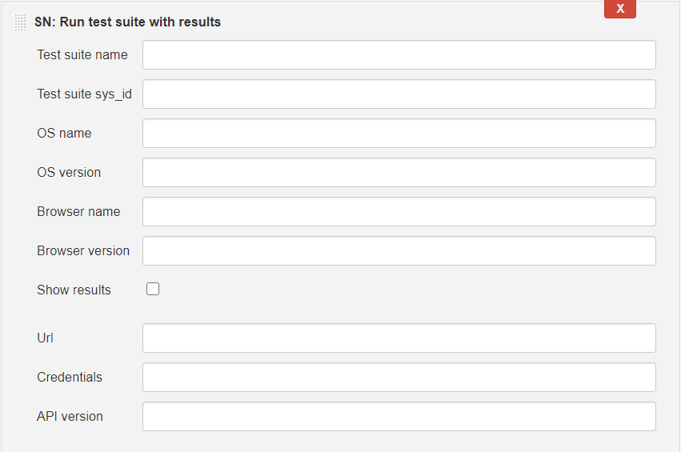

&nbsp; | Description
------| ------------
__Test suite name__ | Required if *Test suite sys_id* is not specified. The name of the test suite to run. This value is located in the Test \[sys_atf_test_suite\] table.
__Test&nbsp;suite&nbsp;sys_id__ | Required if *Test suite name* is not specified. The <code>sys_id</code> of the test suite to run. This value is located in the Test \[sys_atf_test_suite\] table.
__OS name__ | Name of the operating system under which to run the test suite. This value must match what is specified in the scheduled client test runner.
__OS version__ | Starting value of the version of the operating system under which to run the test suite. For example, if you enter "8", that would enable all 8.x.x.x versions. This value must match what is specified in the scheduled client test. runner.
__Browser name__ | Name of the browser to use to run the client test. This value must match what is specified in the scheduled clienttest runner. For additional information on scheduled client test runners, see <a class="extRef" href="https://developer.servicenow.com/app.do#!/training/article/app_store_learnv2_atf_newyork_using_the_automated_test_framework/app_store_learnv2_atf_newyork_scheduled_client_test_runners?v=orlando" target="_blank">Scheduled Client Test Runners</a>.<br/><br/>Valid values:<ul><li>Any</li><li>Chrome</li><li>Firefox</li><li>Edge</li><li>IE</li><li>Safari</li></ul>
__Browser version__ | Starting value of the version of the browser specified in browser_name to use to run the test. For example, if you enter "9", that would enable all 9.x.x.x versions. This value must match what is specified in the scheduled client test runner.
__Show results__ | If the checkbox is checked, then results from ServiceNow will be visible in Output Console, together with the link to the visualization on the NOW platform.
&nbsp; | *Other parameters like described above.*

#### SN: Activate plugin
Activates the specified plugin.

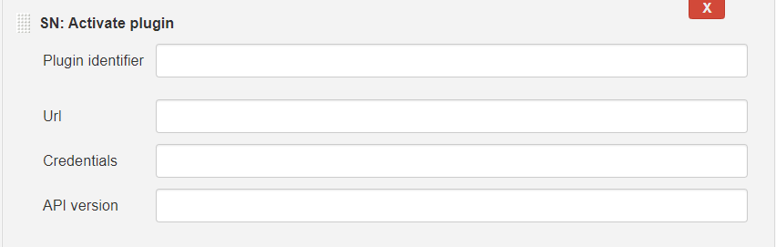

&nbsp; | Description
------| ------------
__Plugin&nbsp;identifier__ | Unique identifier of the plugin. You can locate this identifier on the Plugins page within the card of the desired plugin; identified with the name "ID".
__Url__ | Url of the instance where the plugin should be activated. The field cannot be empty. The url is not taken from ServiceNow Parameters!
__Credentials__ | The field cannot be empty. Credentials are not taken from ServiceNow Parameters!

#### SN: Roll back plugin
Rolls back the specified plugin to the previous installed version. If no prior version has been installed, the build step will fail.

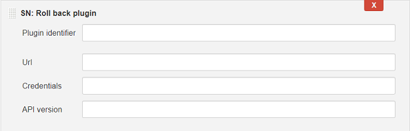

Description of the fields is exactly the same as in the section [SN: Activate plugin](#sn-activate-plugin)

### Global build parameters
Together with the plugin comes additional parameter __ServiceNow Parameters__ under the checkbox *This project is parameterized* in *General* section of the build configuration.

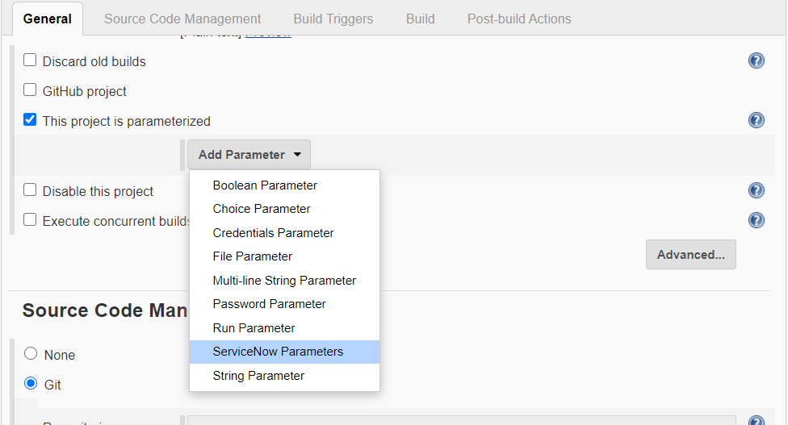

This new parameter or - better to say - set of configuration variables allows user to configure most of the steps (integrated with the platform NOW) in convenient way from one place.
You can find below description of each field, that was implemented here:

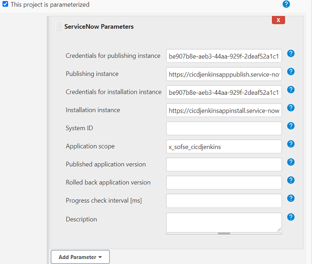

&nbsp; | Description
------ | -----------
__Credentials for publishing instance__ | Credentials ID configured in Jenkins and used to get access to the instance were an application will be or is already published.
__Publishing instance__ | ServiceNow instance url where the application will be published to.
__Credentials&nbsp;for&nbsp;installation&nbsp;instance__ | User name and password defined in global credentials (credentials ID is required here) used for the instance where the application will be installed.
__Installation instance__ | ServiceNow instance url where the application will be installed.
__System ID__ | The system id of the application for which to apply the changes. You can locate this value in the Sys ID field in the Custom Application \[sys_app\] table.
__Application scope__ | The scope name of the application for which to apply the changes, such as x_aah_custom_app. You can locate this value in the scope field in the Custom Application \[sys_app\] table.
__Published application version__ | Version number of published application (that will be also installed if appropriate build step will be used). Do not fill the field up if you want to get the number automatically (depends on the build step *Publish application*).
__Rolled back application version__ | Version number of the application used by the step *Roll back application*. Do not fill this field up if the version should be obtained automatically.
__Progress check interval__ | Time in milliseconds between one and another progress check set up for all build steps of ServiceNow. Leave it empty to use default value.

#### How to use
All build steps delivered by ServiceNow except [SN: Activate plugin](#sn-activate-plugin) and [SN: Roll back plugin](#sn-roll-back-plugin) use some variables defined under *ServiceNow Parameters*.
<br/><br/>
__System ID__ and __Application scope__ are used by all SN build steps related to an application, only then when local parameters of those build steps are not configured (are blank).
<br/><br/>
__Url__ and __Credentials for publishing instance__ are used only by [SN: Apply changes](#sn-apply-changes) and [SN: Publish application](#sn-publish-application), if they do not have specified local adequate parameters.
<br/><br/>
__Url__ and __Credentials for installation instance__ are used only by [SN: Install application](#sn-install-application), [SN: Roll back application](#sn-roll-back-application) and [SN: Run test suite with results](#sn-run-test-suite-with-results), if they do not have specified local adequate parameters.

<br/>
One thing is worth to mention. There are some dependencies between following 3 build steps:

- [SN: Publish application](#sn-publish-application)
- [SN: Install application](#sn-install-application)
- [SN: Roll back application](#sn-roll-back-application)

When an application is published, and the new version is calculated automatically (__Calculate next application version__
is checked in the publishing step), the published version of the application must be stored for the installation step.
This stored variable will be used as information what version of the application should be installed. The field from *ServiceNow Parameters*
\- __Published application version__ - is used for this purpose. It means, that in most cases the field will be empty and not used by a user.
However, the field can be used if we want to specify what exactly version should be used for publishing and/or installation (we do not have to
combine these 2 steps together, they can be used separately in a build configuration).
<br/>
Similar case concerns also steps regarding installation and rolling back of the application. When an application is installed, the installation step
receives also information about previously installed version, so the *Roll back application* step can downgrade successfully the application if needed.
That information is stored in the field __Rolled back application version__ and can be used with provided value as described in previous case, if the user knows exactly
what version should be there.

### Scripting
#### Build steps
There is also possibility to write pipeline scripts using integrated build steps.
You can find keywords of all steps described above, together with configuration parameters.
All names should be self-explanatory.<br/>
There is also *Pipeline Syntax* in Jenkins with __Snippet Generator__ to make easy translation
from UI configuration into scripting language.

Build step | Parameters
---------- | ----------
`snApplyChanges` | <ul><li>`apiVersion`</li><li>`appScope`</li><li>`appSysId`</li><li>`branchName`</li><li>`credentialsId`</li><li>`url`</li></ul>
`snPublishApp` | <ul><li>`apiVersion`</li><li>`appScope`</li><li>`appSysId`</li><li>`appVersion`</li><li>`credentialsId`</li><li>`devNotes`</li><li>`obtainVersionAutomatically`</li><li>`url`</li></ul>
`snInstallApp` | <ul><li>`apiVersion`</li><li>`appScope`</li><li>`appSysId`</li><li>`appVersion`</li><li>`credentialsId`</li><li>`url`</li></ul>
`snRollbackApp` | <ul><li>`apiVersion`</li><li>`appScope`</li><li>`appSysId`</li><li>`credentialsId`</li><li>`rollbackAppVersion`</li><li>`url`</li></ul>
`snRunTestSuite` | <ul><li>`apiVersion`</li><li>`browserName`</li><li>`browserVersion`</li><li>`credentialsId`</li><li>`osName`</li><li>`osVersion`</li><li>`testSuiteName`</li><li>`testSuiteSysId`</li><li>`url`</li><li>`withResults`</li></ul>
`snActivatePlugin` | <ul><li>`apiVersion`</li><li>`credentialsId`</li><li>`pluginId`</li><li>`url`</li></ul>
`snRollbackPlugin` | <ul><li>`apiVersion`</li><li>`credentialsId`</li><li>`pluginId`</li><li>`url`</li></ul>

#### ServiceNow Parameters
ServiceNow Parameters can be also used in a pipeline scripting. They should be defined within `parameters` section and the parameter named as `snParam`.
Some examples of defined SN Parameters can be found in the paragraph [Samples](#samples).<br/>
The parameter includes following arguments (names should be self-explanatory):
 * `credentialsForPublishedApp`
 * `instanceForPublishedAppUrl`
 * `credentialsForInstalledApp`
 * `instanceForInstalledAppUrl`
 * `sysId`
 * `appScope`
 * `publishedAppVersion`
 * `rollbackAppVersion`
 * `progressCheckInterval`

#### Samples
The section covers pipeline scripting with 3 examples using features like build steps and the parameter 
developed by ServiceNow.
All examples can be used in Pipeline type job or as independent _Jenkinsfile_ in a source control connected
with NOW platform.

1. Simple script with one step _Apply changes_ under a stage called `preparation`.
```groovy
pipeline {
    agent any

    stages {
        stage('preparation') {
            steps {
                snApplyChanges url: "https://cicdjenkinsapppublish.service-now.com", credentialsId: "88dbbe69-0e00-4dd5-838b-2fbd8dfedeb4", appScope: "x_sofse_cicdjenkins"
            }
        }
    }
}
```
Link to the [example](examples/pipeline-script-1.groovy).

2. The same script with one step _Apply changes_ but using ServiceNow Parameters defined in the block `parameters`.
Additionally, the content of the parameter `snParam` will be displayed in console output. The content will be represented
in json format.
```groovy
pipeline {
    agent any

    parameters {
            snParam(credentialsForPublishedApp: "88dbbe69-0e00-4dd5-838b-2fbd8dfedeb4", instanceForPublishedAppUrl: "https://cicdjenkinsapppublish.service-now.com", appScope: "x_sofse_cicdjenkins")
    }

    stages {
        stage('preparation') {
            steps {
                echo "${params.snParam}"

                snApplyChanges()
            }
        }
    }
}
```
Link to the [example](examples/pipeline-script-2.groovy).

3. Advanced pipeline script with workflow of publishing and installing an application on NOW platform.
The build was devided into 2 stages: `publishing` and `installation`. The last stage runs additionally 
test suite to check newly installed application.
```groovy
pipeline {
    agent any

    parameters {
            snParam(credentialsForPublishedApp: "88dbbe69-0e00-4dd5-838b-2fbd8dfedeb4", instanceForPublishedAppUrl: "https://cicdjenkinsapppublish.service-now.com",
                    credentialsForInstalledApp:"88dbbe69-0e00-4dd5-838b-2fbd8dfedeb4", instanceForInstalledAppUrl:"https://cicdjenkinsappinstall.service-now.com",
                    appScope: "x_sofse_cicdjenkins")
    }

    stages {
        stage('publishing') {
            steps {
                snPublishApp obtainVersionAutomatically: true
            }
        }
        stage('installation') {
            steps {
                snInstallApp()
                snRunTestSuite browserName: 'Firefox', osName: 'Windows', osVersion: '10', testSuiteName: 'My CHG:Change Management', withResults: true
            }
        }
    }
}
```
Link to the [example](examples/pipeline-script-3.groovy).

## Integration Tests
Integration tests using the CI/CD APIs are located in two classes: `ServiceNowAPIClientIntegrationTest` and `SNStepsIntegrationTest`.
All of the tests have the annotation `Ignore`, because they are not reliable for daily testing and require credentials.
Following steps should be done to activate integration tests:
* remove the annotation `Ignore` from all tests you want to run
* setup NOW's API credentials by setting up following environment variables `USERNAME` and `PASSWORD` (urls of appropriate instances are already configured in test classes, what can be also changed manually in the code).
  This setup can be done in two ways:
  * (1) creating pipeline scripting on private Jenkins instance with junit tests execution:
  ```groovy
  pipeline {
      agent any
  
      environment {
              USERNAME = 'api-username'
              PASSWORD = 'api-password'
          }
  
      tools {
          // Install the Maven version configured as "M3" and add it to the path.
          maven "M3"
      }
  
      stages {
          stage('Test') {
              steps {
                  git url: 'https://github.com/jenkinsci/servicenow-cicd-plugin.git'
                  
                  // Run Maven on a Unix agent.
                  sh "mvn -Dmaven.test.failure.ignore=true test"
  
                  // To run Maven on a Windows agent, use
                  // bat "mvn -Dmaven.test.failure.ignore=true test"
              }
  
              post {
                  // If Maven was able to run the tests, even if some of the test
                  // failed, record the test results and archive the jar file.
                  success {
                      junit '**/target/surefire-reports/TEST-*.xml'
                      archiveArtifacts 'target/*.jar'
                  }
              }
          }
      }
  }
  ```
  * (2) together with `buildPlugin` in _Jenkinsfile_ (eg. on ci.jenkins.io)
      * create global credentials with user name and password on Jenkins instance
      * uncomment lines in _Jenkinsfile_ and replace the `credentialsId` value `482fa2bf-73b5-489a-8f9e-62004e01f10b` by the ID of newly created credentials

## Troubleshooting
Known issues:
- Publishing an application does not make changes in linked repository as it is done directly from UI of NOW platform.
- Following step _Roll back plugin_ should not be placed directly after _Activate plugin_, because finalizing the activation of a plugin
happens also after the build step _Activate plugin_ (although it was completed with success). Trying to roll it back may lead to unclear
status of the plugin on specified instance. Generally the use case will not happen, because usually a plugin is activated once
and nobody would like to deactivate it just after activation.

## Support Model

ServiceNow built this integration with the intent to help customers get started faster in adopting CI/CD APIs for DevOps workflows, but __will not be providing formal support__. This integration is therefore considered "use at your own risk", and will rely on the open-source community to help drive fixes and feature enhancements via Issues. Occasionally, ServiceNow may choose to contribute to the open-source project to help address the highest priority Issues, and will do our best to keep the integrations updated with the latest API changes shipped with family releases. This is a good opportunity for our customers and community developers to step up and help drive iteration and improvement on these open-source integrations for everyone's benefit. 

## Governance Model

Initially, ServiceNow product management and engineering representatives will own governance of these integrations to ensure consistency with roadmap direction. In the longer term, we hope that contributors from customers and our community developers will help to guide prioritization and maintenance of these integrations. At that point, this governance model can be updated to reflect a broader pool of contributors and maintainers. 
